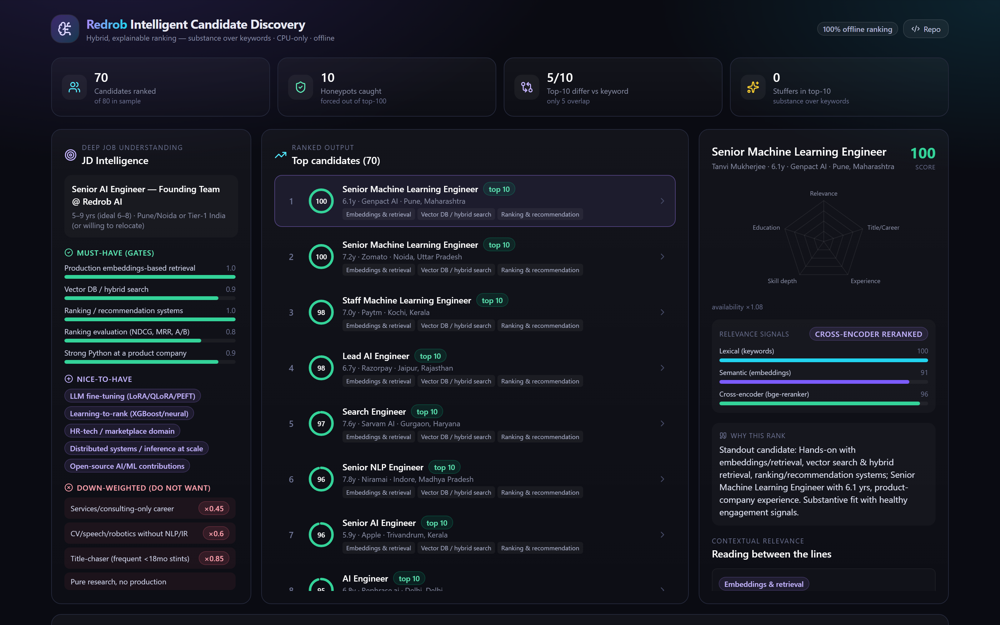
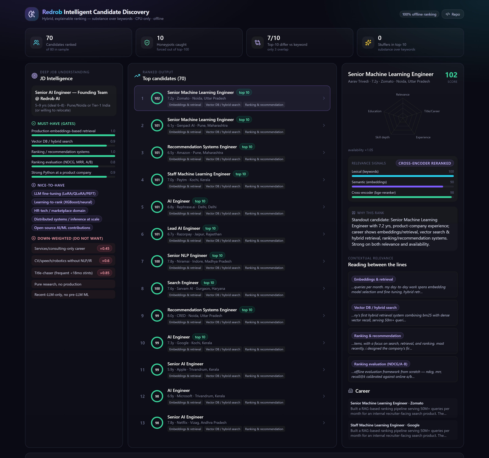

# Redrob Intelligent Candidate Discovery — Ranking Engine

Our submission for the **Hack2Skill × RedRob Data & AI Challenge (Track 01)**: rank the top-100 best-fit
candidates from a 100,000-candidate pool for the *Senior AI Engineer (Founding Team)* job description —
reasoning about **contextual + behavioral fit, not keyword overlap**.

### Highlights
- 🧠 **Retrieve → rerank → reason:** honeypot filter → JD-encoded gated rubric → semantic (bi-encoder) +
  lexical relevance → **cross-encoder rerank** → bounded behavioral multiplier → fact-grounded reasoning.
- 🛡️ **0 honeypots in the top-100** (the hard >10% disqualifier — cleared) via a calibrated
  impossibility filter (65 flagged pool-wide, 0 false positives).
- ⚡ **CPU-only, offline, ~190s** for the full 100k (≤5 min / ≤16 GB) — heavy models run *offline* because
  the JD is fixed; `rank.py` only reads cached artifacts (**stdlib-only**).
- 🚫 **Substance over keywords:** relevance scores what a candidate *built* (career history) and **excludes
  the skills list**, so keyword-stuffers don't rank; an engineering-role gate sinks "Marketing Manager + 9 AI skills".
- 🔬 **Decisions by measurement, not assumption:** the semantic query was chosen via a 3-way ablation and the
  JD's negatives via a full-100k calibration — see `docs/09`.

> **👩‍⚖️ Reviewers, start here:** **`docs/09_results_and_observations.md`** (results, ablation, calibration,
> top-10 audit) · the approach deck **`submission/Redrob_Idea_Submission.pdf`** · the iteration trail
> **`docs/PROJECT_LOG.md`** · reproduce with `just check` (rank + validate).



*The demo sandbox (`just serve`): JD intelligence (must-have **gates** + down-weighted **negatives**),
the ranked **leaderboard**, and a per-candidate **score breakdown** with cross-encoder-reranked relevance
signals and fact-grounded "reading between the lines" reasoning.*

## Results & observations (for reviewers)

- **`docs/09_results_and_observations.md`** — what we measured and decided: validator passes, **0 honeypots
  in top-100**, ~190s CPU/offline run, the 3-way semantic-query ablation, the full-pool JD-negative
  calibration, and the manual top-10 audit. Reproduce with `scripts/quality_proxy.py`,
  `scripts/audit_candidates.py`, `scripts/calibrate_negatives.py`.
- **`docs/jd_text.md`** — the verbatim JD; the semantic query is a distilled, provenance-linked extract
  (`src/jd_profile.py::JD_QUERY_TEXT`).

## Data setup

The challenge bundle is **not** included in this repo (large + provided separately). Place it in `data/`:

```
data/
  candidates.jsonl          # the 100k pool
  validate_submission.py    # format validator
  candidate_schema.json, sample_candidates.json, sample_submission.csv, *.docx, ...
```

`data/` and `old/` are git-ignored.

## Quickstart

Toolchain: **[uv](https://github.com/astral-sh/uv)** (Python, no pip) + **[just](https://just.systems)**
(cross-platform task runner, Windows & Linux/macOS) + npm (frontend UI).

```bash
just              # list all recipes
just install      # uv venv + uv pip install (backend) + npm install (frontend)
just check        # run the ranker -> submission.csv, then validate it
just serve        # build the UI and serve UI + API at http://localhost:8000
```

## Reproduce the submission

```bash
just rank         # -> submission.csv   (or: uv run python src/rank.py --candidates data/candidates.jsonl --out submission.csv)
just validate     # checks the CSV against the challenge format rules
```

The ranker is **stdlib-only** and runs **CPU-only, offline, ≤5 min, ≤16 GB** (embeddings precomputed
offline). See `docs/04_scoring_and_submission.md` for full constraints.

## Demo UI (the sandbox)

```bash
just api          # FastAPI backend at http://localhost:8000
just web          # React dev server at http://localhost:5173 (proxies /api)
```

A Vite + React + Tailwind dashboard that visualizes the ranking, score breakdowns, "reading between the
lines" evidence, and honeypot/trap detection. See `docs/08_demo_ui.md`. Deploy as a single Hugging Face
Docker Space (`just docker-build` / `just docker-run` for the local container).



## Approach (one paragraph)

A **hybrid, explainable, CPU-only pipeline**: a honeypot/impossibility filter, JD-encoded hard-gates and
soft-penalties, semantic relevance (precomputed embeddings + BM25 over career-description text — to catch
strong candidates who don't use buzzwords), structured feature scoring (title/career evidence, experience
band, skill *depth*, education), and a bounded behavioral-availability multiplier from the 23 Redrob signals.
Reasoning strings are templated from real profile facts, so they cannot hallucinate. Full rationale in `docs/`.

## Assumptions

- **The JD is fixed** for this challenge, so all heavy models (embeddings, cross-encoder) are computed
  **offline once** and cached; `rank.py` only reads cached artifacts and stays CPU-only/offline.
- **Compute limits bind the *ranking step* only** (`rank.py`: ≤5 min, ≤16 GB, CPU, no network); offline
  precompute may use a GPU and longer wall-clock (per the spec).
- **Ground truth is hidden** (no leaderboard), so quality is validated by proxies — manual top-N audit,
  automated quality heuristics, honeypot rate, and ablations — not by a measured score (see `docs/09`).
- **Honeypots are forced to tier 0**; our impossibility filter is calibrated to flag only genuinely
  impossible profiles (0 false positives on the pool) — we do not special-case beyond that.
- **The pool is synthetic**: the JD's "research-only / stale-architect / recent-LLM" disqualifiers do not
  manifest as detectable populations here, so they are intentionally not penalized (calibrated, `docs/09`).
- **`reasoning` is templated from data, not an LLM** — a deliberate choice to eliminate hallucination risk.

## Repository layout

```
docs/                     Challenge understanding + design (read 00 -> 09)
  00_challenge_overview.md … 08_demo_ui.md
  09_results_and_observations.md   Results, semantic-query ablation, negative calibration, top-10 audit
  jd_text.md                       Verbatim JD (provenance for the semantic query)
  PROJECT_LOG.md                   Chronological project journal (decisions, experiments, results)
src/                      Ranking package: data_loader · jd_profile · honeypot · features · scoring · reasoning · rank.py
scripts/                  precompute (embeddings+reranker) + analysis: quality_proxy · audit_candidates · calibrate_negatives · build_deck · csv_to_xlsx
app/ + frontend/          Demo sandbox: FastAPI backend + Vite/React UI (single Docker image)
submission/               Submission assets: approach deck (PDF) + DECK_CONTENT.md (ranked output / decks are git-ignored)
requirements.txt          Ranker deps (CPU-only, offline; ranker itself is stdlib-only)
submission_metadata.yaml  Portal metadata (mirrors submission spec)
```

## Documentation

Start with `docs/00_challenge_overview.md`. The running log of what we've done and decided lives in
`docs/PROJECT_LOG.md`.
