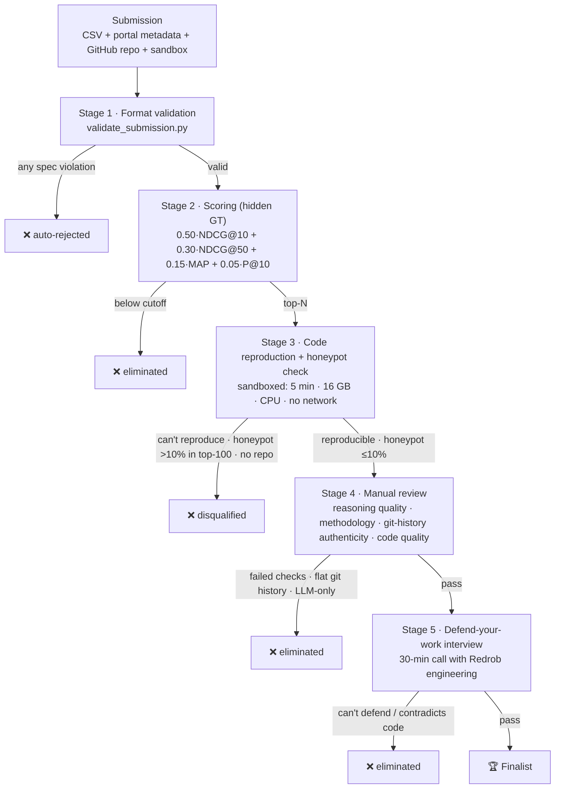

# 00 — Challenge Overview

**Event:** Hack2Skill × RedRob — *Data & AI Challenge, Track 01: Intelligent Candidate Discovery*
**Our role:** AI/ML engineering team building a candidate ranking Proof of Concept.

## The one-sentence problem

Given **one job description** and a pool of **100,000 candidate profiles**, produce a **ranked shortlist of
the top 100 best-fit candidates** as a CSV — where "best fit" means deep contextual + behavioral fit, *not*
keyword overlap.

## Why it's hard (the actual point of the challenge)

Traditional keyword filtering fails here on purpose. The dataset is adversarial:

- The **right** candidates may never use the buzzwords in the JD ("plain-language Tier-5s").
- The **wrong** candidates may have a perfect-looking skill list but the wrong job/career ("keyword stuffers").
- ~80 **honeypots** have logically impossible profiles and must be kept out of the top ranks.
- Behavioral signals decide who is *actually hireable* vs perfect-on-paper-but-unavailable.

So the system must **reason about the gap between what the JD says and what it means**, and weigh static
profile fit against behavioral availability.

## What we must deliver (3 parts, all required)

1. **The CSV** — top-100 ranking: `candidate_id,rank,score,reasoning`. (See `04_scoring_and_submission.md`.)
2. **The code** — a GitHub repo that reproduces the CSV from `candidates.jsonl` with **one command**,
   within compute limits, plus a README, `requirements.txt`, and `submission_metadata.yaml`.
3. **A hosted sandbox** — HuggingFace Spaces / Streamlit / Replit / Colab / Docker / Binder that runs the
   ranker on a small sample (≤100 candidates) end-to-end.

## The 5-stage evaluation pipeline (how submissions are filtered)

| Stage | What happens | What eliminates you |
|------|---------------|---------------------|
| 1. Format validation | `validate_submission.py` runs on every submission | Any spec violation (wrong rows, dup ranks, non-monotonic score, etc.) |
| 2. Scoring | Composite computed **once** on hidden ground truth after close | Score below advancement cutoff |
| 3. Code reproduction + honeypot check | Top-N repos reproduced in sandbox (5 min, 16 GB, no GPU, no net) | Can't reproduce in limits; **honeypot rate > 10% in top-100**; missing/fabricated repo |
| 4. Manual review | Reasoning quality (6 checks), methodology coherence, **git-history authenticity**, code quality | Failed reasoning checks; flat/single-dump git history; codebase is just LLM API calls |
| 5. Defend-your-work interview | 30-min call with Redrob engineering | Can't explain/defend architecture; contradicts submitted code |

## Rules that shape strategy

- **No live leaderboard, no feedback.** Scores revealed only after close. We must validate **locally** via
  methodology and reasoning quality — not by probing the leaderboard.
- **Max 3 submissions; last valid one counts.** Each submission is precious; iterate offline.
- **AI tools allowed** (declare honestly). The pipeline is designed so AI-assisted *real engineering* passes
  but paste-and-pray fails at Stages 3–5. → We must do genuine engineering and keep an auditable git history.
- **Compute is hard-capped** on the ranking step: ≤5 min, ≤16 GB, CPU-only, **network off**. No per-candidate
  LLM calls. Heavy precompute (embeddings/index) is allowed *offline*, but the CSV-producing step must fit.

## Strategic implications (drive every later decision)

1. **Top-10 dominates** the score (NDCG@10 = 0.50 weight). Get the top 10 *exactly* right.
2. **Never let a honeypot into the top 100** (ideally top of mind for top-10). It's a hard DQ.
3. **Explainability is graded** — reasoning must cite real profile facts and honest concerns.
4. **Reproducibility & git history are graded** — build iteratively, commit often, keep it CPU/offline.

See `05_approach_and_roadmap.md` for the architecture that follows from these.
