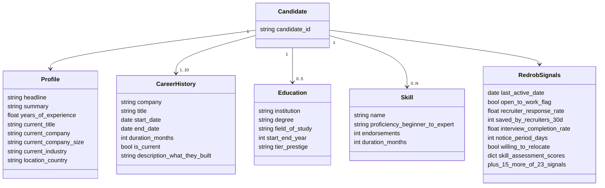

# 02 — Dataset & Behavioral Signals

Sources: `candidate_schema.json`, `redrob_signals_doc.docx`, `sample_candidates.json`, and a verified
full-pool scan of `candidates.jsonl`.

## Files in the bundle

| File | What it is |
|------|-----------|
| `candidates.jsonl` | **100,000** candidate profiles, one JSON per line (~465 MB). The pool we rank. |
| `sample_candidates.json` | First 50 candidates, pretty-printed — quick schema inspection. |
| `candidate_schema.json` | JSON-Schema (draft-07) for one candidate record. |
| `job_description.docx` | The JD we rank against (see `01_…`). |
| `submission_spec.docx` | Format, rules, metrics, compute limits, 5-stage pipeline (see `04_…`). |
| `redrob_signals_doc.docx` | Reference for the 23 behavioral signals. |
| `sample_submission.csv` | Format reference only — **deliberately low-quality** (falls for keyword-stuffer trap). |
| `validate_submission.py` | The format validator (run before every submission). |
| `submission_metadata_template.yaml` | Portal metadata template. |

## Candidate record structure (top-level)




```
candidate_id        "CAND_XXXXXXX" (7 digits)  — unique, exists in candidates.jsonl
profile             { anonymized_name, headline, summary, location, country,
                      years_of_experience (0–50), current_title, current_company,
                      current_company_size (enum buckets), current_industry }
career_history[]    1–10 jobs: { company, title, start_date, end_date|null,
                      duration_months, is_current, industry, company_size, description }
education[]         0–5: { institution, degree, field_of_study, start_year, end_year,
                      grade|null, tier: tier_1..tier_4|unknown }   ← institution prestige
skills[]            0–N: { name, proficiency: beginner|intermediate|advanced|expert,
                      endorsements (int≥0), duration_months }
certifications[]    { name, issuer, year }
languages[]         { language, proficiency }
redrob_signals      { 23 behavioral signals — see below }
```

> **Two different "tier" concepts — don't confuse them:**
> - `education[].tier` (tier_1..tier_4/unknown) = **institution prestige**, a profile field.
> - **Relevance tier** (0–5) = the **hidden ground-truth** label we're scored against. Honeypots are forced
>   to relevance tier 0; "tier 3+" counts as relevant for P@10. These are *not* in the data.

## Verified pool distributions (full 100k scan)

- **Titles are dominated by non-tech roles** (each ~5,800): Business Analyst, HR Manager, Mechanical Engineer,
  Accountant, Project Manager, Customer Support, Operations Manager, Content Writer, Sales Executive,
  Civil Engineer, Graphic Designer, Marketing Manager. These are the **keyword-stuffer haystack**.
- **Tech titles** (mid counts): Software Engineer 3,450; Full Stack 2,873; Cloud 2,836; Java 2,809;
  .NET 2,788; DevOps 2,787; Mobile 2,757; Frontend 2,738; QA 2,682.
- **Rare relevant titles:** Analytics Engineer 764, Data Engineer 744, Data Analyst 728, Backend Engineer 704.
- **AI/ML-titled candidates: only ~722** (title contains ai/ml/machine-learning/nlp/data-scientist/research).
  → The genuine fits are a *tiny* fraction; most "AI-skilled" profiles are mislabeled noise or stuffers.
- **Geography:** 75% India; then USA 9,978, Australia, Canada, UK, Germany, Singapore, UAE. Indian cities
  spread evenly across ~15 metros (Bangalore, Hyderabad, Pune, Noida, Delhi, Chennai, etc.).
- **YOE:** min 1.0, max 16.9, mean 7.2, median 6.8 — the 5–9 band is well-populated.
- **recruiter_response_rate:** mean 0.44, median 0.44 — wide spread, a strong differentiator.

## The 23 `redrob_signals` (behavioral layer)

These measure *who is actually hireable*, not paper fit. We use them as a **multiplicative availability/quality
modifier** on top of relevance — never to override a genuine skills/career fit, but to break ties and to sink
perfect-on-paper-but-unreachable candidates.

| # | Signal | Type | How we use it |
|---|--------|------|---------------|
| 1 | profile_completeness_score | 0–100 | mild quality prior; very low = thin profile |
| 2 | signup_date | date | tenure on platform (minor) |
| 3 | **last_active_date** | date | **recency of activity — stale (6+ mo) = strong down-weight** |
| 4 | **open_to_work_flag** | bool | available now = up-weight |
| 5 | profile_views_received_30d | int | demand proxy (mild) |
| 6 | applications_submitted_30d | int | job-seeking intent (mild) |
| 7 | **recruiter_response_rate** | 0–1 | **will they reply — low rate = unreachable, strong factor** |
| 8 | avg_response_time_hours | ≥0 | responsiveness (mild; lower better) |
| 9 | skill_assessment_scores | dict skill→0–100 | **objective skill validation** — corroborates self-reported proficiency, exposes stuffers |
| 10 | connection_count | int | network size (weak) |
| 11 | endorsements_received | int | social proof (weak; can be gamed) |
| 12 | **notice_period_days** | 0–180 | JD wants ≤30; lower = up-weight |
| 13 | expected_salary_range_inr_lpa | {min,max} | budget fit (mild; we don't know the band — use cautiously) |
| 14 | preferred_work_mode | enum | hybrid/flexible aligns with JD (mild) |
| 15 | **willing_to_relocate** | bool | relocation to Noida/Pune matters for non-local |
| 16 | github_activity_score | -1..100 | engineering activity; -1 = no GitHub (don't punish hard) |
| 17 | search_appearance_30d | int | visibility (weak) |
| 18 | **saved_by_recruiters_30d** | int | recruiter interest — strong positive |
| 19 | **interview_completion_rate** | 0–1 | follow-through; low = flaky |
| 20 | offer_acceptance_rate | -1..1 | -1 = no history; high = serious about moving |
| 21 | verified_email | bool | contactability (mild) |
| 22 | verified_phone | bool | contactability (mild) |
| 23 | linkedin_connected | bool | reachability (mild) |

### Behavioral modifier design (preliminary)

- **Core availability factors (high weight):** `last_active_date` recency, `recruiter_response_rate`,
  `open_to_work_flag`, `interview_completion_rate`, `saved_by_recruiters_30d`, `notice_period_days`.
- **Corroboration:** `skill_assessment_scores` cross-checked against self-reported `proficiency` — a candidate
  claiming "expert" with a 30/100 assessment is suspect; a high assessment validates a plain-language fit.
- **Treat -1 sentinels** (`github_activity_score`, `offer_acceptance_rate`) as "unknown", not "bad".
- Combine into a bounded multiplier (e.g. ~0.5–1.15×) so it modulates rather than dominates relevance.

> Example (`CAND_0000001`): response_rate 0.34, avg_response 178 h (slow), saved_by_recruiters 4,
> interview_completion 0.71, notice 60 d, willing_to_relocate **false**, onsite, last_active recent. Mixed
> availability — would get a mild down-modifier even before the JD soft-negatives apply.
