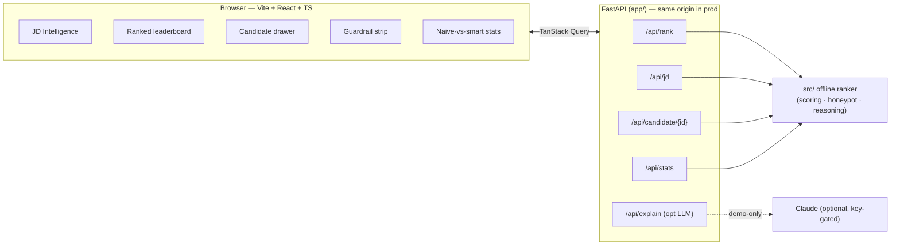

# 08 — Demo UI & Sandbox

The fancy, jury-facing demo that doubles as the **mandatory sandbox** (docs/04 §10.5). It is *not* scored
on NDCG, but is decisive at Stage 4 (manual review) and Stage 5 (defend-your-work interview). The scored
ranking stays 100% offline/CPU; the UI only visualizes it (plus one clearly-separated optional LLM panel).

## Architecture



- **Backend** (`app/`): FastAPI wraps `src/`. `ranker_service.py` builds UI payloads (ranked rows + score
  breakdown + reading-between-the-lines snippets + gap analysis + naive-keyword comparison). Loads a curated
  **80-candidate demo sample** (`app/demo_data/demo_candidates.jsonl` = 30 top + 15 stuffers + 10 honeypots +
  25 random) once at startup.
- **Frontend** (`frontend/`): Vite + React 19 + TS + Tailwind 4 + shadcn-style primitives + TanStack Query +
  Recharts + Framer Motion. `base: './'` and a dev proxy (`/api` → :8000).
- **One deploy**: FastAPI serves the built `frontend/dist` at `/` and the API at `/api/*` → a single sandbox URL.

## Core wow-set (built)

| Panel | Challenge capability it showcases |
|-------|-----------------------------------|
| **JD Intelligence** — capability rubric (must-have weights / nice-to-have / down-weighted negatives) | Deep Job Understanding |
| **Ranked leaderboard** — animated, score-ring rows, matched-concept chips, concern badges | Ranked Output |
| **Candidate drawer** — Recharts radar of the 5 components, availability ×modifier, penalties | Signal Integration + explainability |
| **Reading between the lines** — career snippets that matched JD concepts *without* buzzwords | Contextual Relevance |
| **Guardrail + naive-vs-smart** — honeypots caught; top-10 overlap vs a keyword ranker (≈3/10) | Trust / "we're not fooled" |

Plus an **optional "Narrate with AI"** button (calls `/api/explain`; demo-only; never changes ranks; degrades
gracefully to an explanatory note when no `ANTHROPIC_API_KEY` is set).

## Run locally

```bash
# backend (serves API; also serves frontend/dist if built)
pip install -r app/requirements.txt
uvicorn app.main:app --port 8000

# frontend dev (hot reload, proxies /api -> :8000)
cd frontend && npm install && npm run dev      # http://localhost:5173

# production-style (single origin)
cd frontend && npm run build                    # -> frontend/dist
uvicorn app.main:app --port 8000                # http://localhost:8000 serves UI + API
```

## Deploy as the sandbox (Hugging Face Docker Space)

The repo `Dockerfile` builds the UI and serves everything on `$PORT` (7860 on HF). Two options:

**A. Connect the GitHub repo** — create a new Space → SDK **Docker** → link `tsathya98/redrob-candidate-ranker`.
**B. Push to the Space remote:**
```bash
# one-time: authenticate (run yourself; interactive)
#   ! huggingface-cli login
huggingface-cli repo create redrob-ranker --type space --space_sdk docker
git remote add space https://huggingface.co/spaces/<user>/redrob-ranker
git push space master
```
Add `ANTHROPIC_API_KEY` as a **Space secret** to enable the optional AI-narration panel (leave unset to keep
it fully offline). The Space README needs Docker-SDK frontmatter:
```yaml
---
title: Redrob Candidate Ranker
sdk: docker
app_port: 7860
---
```
**`docker run` fallback** (spec-accepted): `docker build -t redrob . && docker run -p 7860:7860 redrob`.

> Local note: Docker/HF CLI were not available in the dev environment, so the image build + Space deploy are
> run by the user. The stack is verified end-to-end via uvicorn (FastAPI serves the built UI + API).

## Maximal-showcase BACKLOG (after the core set lands)

Tracked here so it's not lost (user requested core-first, then maximal):

1. **Gap analysis upgrade** (RedRob "secret weapon" style) — richer missing-vs-JD view with suggested rephrasings.
2. **Naive-keyword ↔ our-ranker toggle** — side-by-side reorder animation telling the "~48% keyword baseline"
   story end-to-end (data already exposed via `stats.naive_top10` / `smart_top10`).
3. **Animated pipeline visualization** — retrieve → honeypot filter → score → behavioral modifier → rank.
4. **Pool analytics dashboard** — title/skill/geo distributions, honeypot gallery, score histograms.
5. **Upload-your-own sample** — drag a JSONL of ≤200 candidates and rank live (endpoint already supports it).
6. **Slice 2 hook** — surface the semantic (embedding) sub-score alongside lexical once Slice 2 lands.
